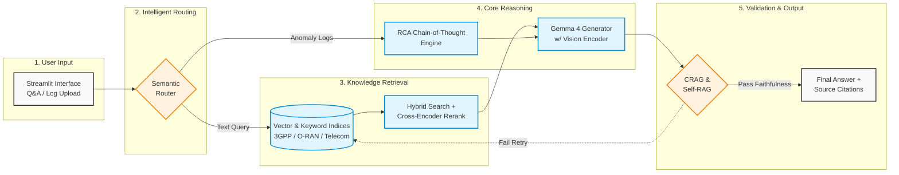

# TeleRAG-4 Simplified Architecture (PPT Landscape)

> **Instructions for PPT:** Copy and paste the Mermaid code below into a Mermaid visualizer (like [mermaid.live](https://mermaid.live) or a native PPT Mermaid add-in), then export as an image or insert directly into your slide. It is specifically designed to flow left-to-right (LR) to maximize the use of widescreen landscape space.

### Key Differences from Actual Architecture (for talking points):
* **Flattened Retrieval:** The 4-layer retrieval (BGE, RRF, Cross-Encoder, CRAG grader) is compressed into a single "Search" box to save visual space.
* **Abstracted Data Sources:** 3GPP specs, ORAN-Bench, and TeleQnA are grouped under a single "Vector & Keyword Indices" database icon.
* **Unified Generation:** Context assembly, citation enforcement, and vision processing are merged into the central "Gemma 4 Generator" node.
* **Linear Flow:** Switched from Top-to-Bottom (`TB`) to Left-to-Right (`LR`) to perfectly fit a standard 16:9 presentation slide without squishing.
