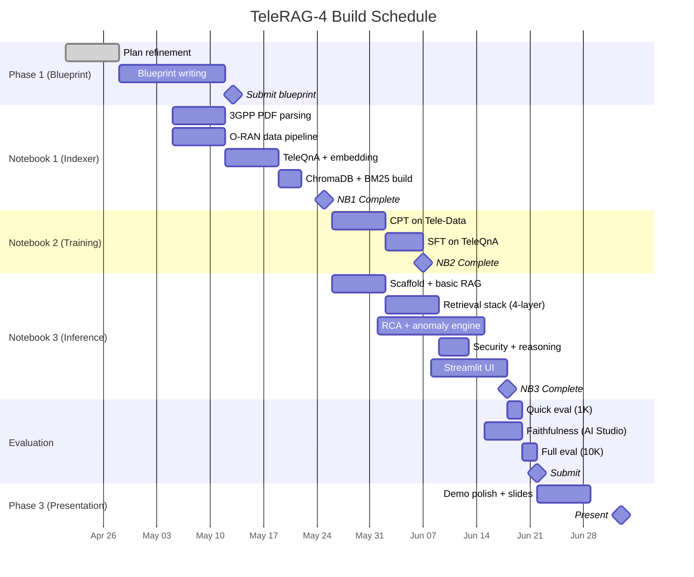

# ⏱️ TeleRAG-4 — Timeline Analysis vs. Hackathon Schedule

## Hackathon Structure (3 Phases)

| Phase | Deadline | Days Remaining (May 12) | What's Due |
|---|---|---|---|
| **Phase 1** | **May 13, 2026** | **1 day 🔴** | Solution Blueprint (architecture doc) |
| *Qualification* | *May 26* | *14 days* | Announcement: qualified teams for Phase 2 |
| **Phase 2** | **Jun 22, 2026** | **41 days** | Full working solution + evaluation results |
| *Qualification* | *Jun 29* | *48 days* | Announcement: shortlisted teams for Phase 3 |
| **Phase 3** | **Jul 3, 2026** | **52 days** | Live online presentation + demo |

---

## Key Insight: This Is NOT a Sprint

> [!IMPORTANT]
> We have **41 days** to deliver Phase 2 (May 13 → Jun 22). This fundamentally changes what's feasible:
> - **Compute budget:** 2 people × 30 Kaggle GPU hrs/week × ~6 weeks = **~360 GPU hours**
> - **Stretch goals** like HippoRAG 2-lite and adaptive k-selection become realistic
> - **Multiple training iterations** are possible — we can tune LoRA hyperparameters
> - **Proper evaluation** with full 10K TeleQnA + faithfulness via AI Studio is very feasible
> - **Polish time** — the Streamlit UI can be genuinely impressive, not just functional

---

## Phase 1: Solution Blueprint (Apr 21 → May 13) — DEADLINE TOMORROW 🔴

**Goal:** Submit blueprint PPT that convinces judges to qualify us for Phase 2.

**Status as of May 12:**
- [x] Architecture design (TeleRAG-4 roadmap v3)
- [x] Critical analysis & gap identification (v2)
- [x] Dataset strategy finalized (v2 — O-RAN decision locked)
- [x] Security & Privacy section added
- [x] PPT writing guide prepared (v2)
- [ ] **Blueprint PPT — SUBMIT BY MAY 13** 🔴

### Phase 1 Completed Work

| Week | Dates | Tasks | Status |
|---|---|---|---|
| **Week 1** | Apr 21 – Apr 27 | Architecture refinements, critical analysis, security gap fix, dataset research | ✅ Done |
| **Week 2** | Apr 28 – May 4 | PPT blueprint structure, KPI projections, innovation highlights | ✅ Done |
| **Week 3** | May 5 – May 12 | Dataset analysis v2, O-RAN decision locked, security section added, PPT finalization | ✅ Done |
| **May 13** | | **SUBMIT BLUEPRINT PPT** | 🔴 Tomorrow |

### Blueprint Document Structure (Recommended)

```
1. Executive Summary
2. Problem Understanding & Scope
3. Solution Architecture (TeleRAG-4)
   - Architecture diagram
   - 4-layer retrieval stack
   - RCA Chain-of-Thought engine
   - CRAG loop
4. Technical Innovation
   - Contextual Retrieval chunking for 3GPP
   - Semantic query routing
   - Multimodal table processing via Gemma 4 vision
   - Self-RAG with citation enforcement
5. Data Strategy
   - 3GPP specs, Colosseum O-RAN, TeleQnA
   - Anomaly-to-prose conversion
6. Training Strategy
   - 2-stage LoRA (CPT + SFT)
   - Train/eval split (80/20 stratified)
7. Technology Stack & Resource Plan
   - VRAM budgets
   - 2-person compute allocation
8. Security & Privacy
   - Input sanitization, output guardrails, data isolation
9. Evaluation Plan
   - KPI targets with technique-by-technique projections
   - Faithfulness eval via Gemma 4 27B (AI Studio)
10. Timeline & Milestones
11. Team & Roles
```

---

## Phase 2: Full Solution Build (May 13 → Jun 22)

**Available time:** 40 days (if we start building May 13 after blueprint submission)  
**Effective build time:** 35 days (accounting for 5 days buffer/unexpected issues)  
**But:** If we start building in parallel during Phase 1, we gain an extra 1-2 weeks.

### Compute Budget (Revised — 8 Weeks of Phase 2)

| Resource | Per Person/Week | Weeks Available | Total |
|---|---|---|---|
| Kaggle GPU (T4) | 30 hrs | ~6 weeks (May 13 → Jun 22) | **360 hrs** |
| Colab Free GPU | ~10-15 hrs (unreliable) | ~6 weeks | **~60-90 hrs** |
| **Total GPU** | | | **~420-450 hrs** |

> [!NOTE]
> Previous concern was "37 hrs tight in 1 week." With **420+ GPU hours**, compute is no longer a bottleneck. We can afford:
> - Multiple CPT runs with different hyperparameters
> - LoRA rank sweeps (r=8, 16, 32)
> - Full 10K evaluation runs (multiple iterations)
> - Keep notebooks running for extended inference testing

### Week-by-Week Execution Schedule

| Week | Dates | Person 1 | Person 2 | Milestone |
|---|---|---|---|---|
| **W1** | May 13 – 18 | NB1: 3GPP spec download + `.docx→.pdf` conversion + contextual chunking | NB1: Colosseum COMMAG clone + anomaly injection script + ORAN-Bench-13K parsing | Data pipeline started |
| **W2** | May 19 – 25 | NB1: TeleQnA processing + embedding + ChromaDB build | NB1: O-RAN prose templates + Incident KB + BM25 indices + Tele-Data download | **Notebook 1 COMPLETE** ✅ |
| **W3** | May 26 – Jun 1 | NB3: Scaffold inference server, load models, test basic RAG | NB2: Phase 1 CPT on Tele-Data (4-6 GPU hrs) | CPT training done |
| **W4** | Jun 1 – 7 | NB3: Implement query router + hybrid search + RRF | NB2: Phase 2 SFT on TeleQnA 8K train set (2-3 GPU hrs) | **Notebook 2 COMPLETE** ✅ |
| **W5** | Jun 8 – 14 | NB3: Cross-encoder reranker + CRAG loop + query decomposition | NB3: RCA CoT engine + anomaly detection pipeline | Core pipeline working |
| **W6** | Jun 15 – 18 | NB3: **Security layer** (input/output guardrails) + reasoning traces | Streamlit UI: 3 modes + eval dashboard | **Full pipeline COMPLETE** ✅ |
| **W7** | Jun 18 – 20 | Run 1K quick eval → debug → fix | Run faithfulness eval via AI Studio API (2K held-out set) | KPIs measured |
| **W8** | Jun 20 – 22 | Run full 10K eval + compile results | Final testing, documentation, submission | **SUBMIT** 🚀 |

### Critical Path



### Build Window

> [!IMPORTANT]
> **Phase 1 complete. Building starts May 13** (tomorrow).
> - **May 13 → Jun 22:** Full build mode (41 days)
> - Security layer is now a **scheduled Week 6 deliverable**, not an afterthought

---

## Phase 3: Presentation (Jun 22 → Jul 3)

**Available time:** 11 days for demo prep (only if shortlisted on Jun 29, but prepare anyway)

| Day | Task |
|---|---|
| Jun 22 – 25 | Build presentation slides: architecture, innovation, results |
| Jun 25 – 28 | Record demo video: walkthrough of all 3 Streamlit modes |
| Jun 28 – 30 | Prepare for live Q&A: anticipate judge questions |
| Jul 1 – 2 | Rehearse presentation (2-3 dry runs) |
| **Jul 3** | **Live presentation** |

### Demo Script (What to Show)

1. **3GPP Q&A Mode** — Ask a complex multi-hop question, show query decomposition, show reasoning trace, show citations
2. **Root Cause Analysis** — Upload a sample anomaly CSV, walk through the 5-step CoT chain live
3. **Anomaly Detection** — Show real Colosseum data with injected anomalies, display detection results
4. **Evaluation Dashboard** — Show live KPI numbers (MRR, Accuracy, Faithfulness) beating all targets
5. **Security** — Demonstrate input sanitization catching a PII-laden query

---

## Revised Risk Assessment (With Extended Timeline)

| Risk | Previous Assessment | Updated Assessment | Why |
|---|---|---|---|
| Compute budget | 🟡 Tight | 🟢 **Comfortable** | 420+ GPU hrs vs 37 needed |
| CPT training time | 🟡 Medium | 🟢 **Low** | Can run multiple iterations |
| LoRA hyperparameter tuning | ❌ No time | 🟢 **Feasible** | Can sweep r=8,16,32 |
| Full 10K evaluation | 🟡 Tight | 🟢 **Easy** | Multiple eval runs possible |
| Faithfulness via AI Studio | 🟡 Rate-limited | 🟢 **Comfortable** | 2 accounts × 6 weeks = plenty |
| Streamlit UI polish | 🟡 Minimal | 🟢 **Can be premium** | 10+ days for UI work |
| Stretch goals (HippoRAG 2-lite) | ❌ Impossible | 🟡 **Possible** | If core is done by Week 5 |
| Blueprint quality | N/A | 🟡 **Critical** | Must qualify for Phase 2 first |

---

## Stretch Goals: Now Feasible?

With 420+ GPU hours and 40 build days, some stretch goals move from "impossible" to "attempt if core is solid":

| Stretch Goal | Effort | When to Attempt | Feasibility |
|---|---|---|---|
| **HippoRAG 2-lite** (KG for multi-hop) | ~15-20 hrs | Week 6 if core is done | 🟡 Possible |
| **Adaptive k selection** | ~4-5 hrs | Week 5 | 🟢 Likely |
| **Streaming token generation** | ~3-4 hrs | Week 6 | 🟢 Likely |
| **Explainability dashboard** | ~8-10 hrs | Week 6-7 | 🟡 Possible |
| **ColO-RAN dataset** (second O-RAN source) | ~3-4 hrs | Week 2 | 🟢 Likely |

---

## Questions for You

> [!IMPORTANT]
> **Q1: Early building during Phase 1?**
> Should Person 2 start downloading data and building Notebook 1 while Person 1 writes the blueprint? This gains ~2 weeks but splits focus.

> [!IMPORTANT]
> **Q2: Blueprint format?**
> Do you know what format the "Solution Blueprint" should be? PDF? Specific template? Word limit? This will determine how much of our plan we can include vs. what needs to be condensed.

> [!IMPORTANT]
> **Q3: Have you registered the team yet?**
> Registration appears to be part of the May 13 deadline. Need to confirm if separate registration is needed before that.
